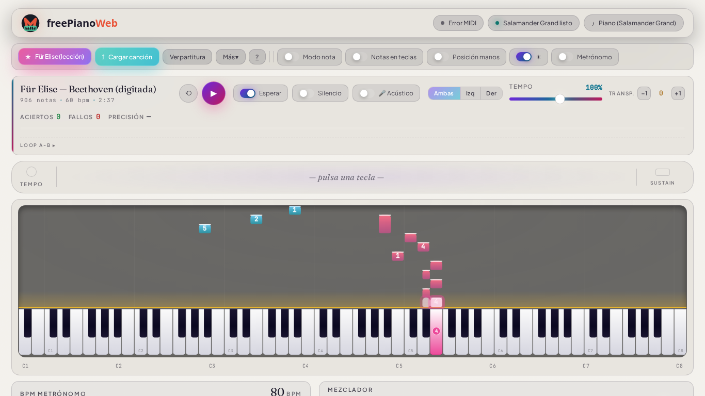

<h1 align="center">freePianoWeb</h1>

Aprende piano en el navegador — con tu teclado MIDI, con el ratón, o con
<strong>cualquier piano o acordeón físico usando solo el micrófono</strong>.

<strong><a href="https://alcidesmanos.github.io/freePianoWeb/">▶ Abrir la aplicación</a></strong>
· <a href="https://alcidesmanos.github.io/freePianoWeb/ayuda.html">Manual de uso</a>

## Qué hace

- 🎹 **Piano de 88 teclas** con samples reales (Salamander Grand) y 20 instrumentos
- 🎵 **Lecciones interactivas**: notas que caen, modo Esperar (la canción aguarda tu tecla), digitaciones, guía de posición de manos, manos separadas, loop A-B con subida de tempo
- 📄 **Carga tus partituras**: MusicXML (.xml/.mxl) con partitura y cursor, o MIDI (.mid) — arrastra y suelta
- 🔌 **Teclado MIDI por USB**: detección automática (integración fina con Yamaha PSR-E363)
- 🎤 **Modo acústico**: practica melodías en un piano o acordeón físico SIN cables — el micrófono valida cada nota
- 🎓 **Teoría en vivo**: acordes detectados al tocar, números romanos, escalas resaltadas, círculo de quintas interactivo, entrenamiento de oído
- ⏺ **Grabadora MIDI** con cuantizador (1/8, 1/16, swing) y export a `.mid`
- ☀🌙 Tema claro y oscuro · modo Sencillo por defecto · funciona offline una vez cargada

## Cómo usarla

1. **Online**: abre [la app](https://alcidesmanos.github.io/freePianoWeb/) en **Chrome o Edge** y pulsa *Comenzar*.
2. **Local**: descarga [`piano_pro.html`](piano_pro.html) — es **un solo archivo**: cópialo donde quieras y ábrelo con doble click.
3. Pulsa **★ Für Elise** (viene incluida, con digitaciones) o carga tu propia partitura.
4. ¿Teclado MIDI? Conéctalo por USB antes de abrir — se detecta solo. ¿Sin teclado? Activa **🎤 Acústico** y toca tu instrumento real frente al micrófono.

## Calidad

183 tests automatizados en 3 capas (unitarias, humo HTML↔JS y Chromium real) + auditoría
de precisión reproducible: jitter de reproducción **2.28 ms** (grado profesional),
accesibilidad **axe-core con cero violaciones** en ambos temas. Detalles en
[`TECNICO.md`](TECNICO.md) y el [informe de auditoría](https://alcidesmanos.github.io/freePianoWeb/informe_auditoria.html).

## Familia free*

freePianoWeb es parte de la familia de herramientas libres del autor:
**freeDFDWeb** (diagramas de flujo) · **freeBPMN** (procesos) · **freePianoWeb** (música).

## Autor

**Alcides Sanchez** · [LinkedIn](https://www.linkedin.com/in/alcides-sanchez-b4772a35/)

## Licencia

[MIT](LICENSE) © 2026 Alcides Sanchez
